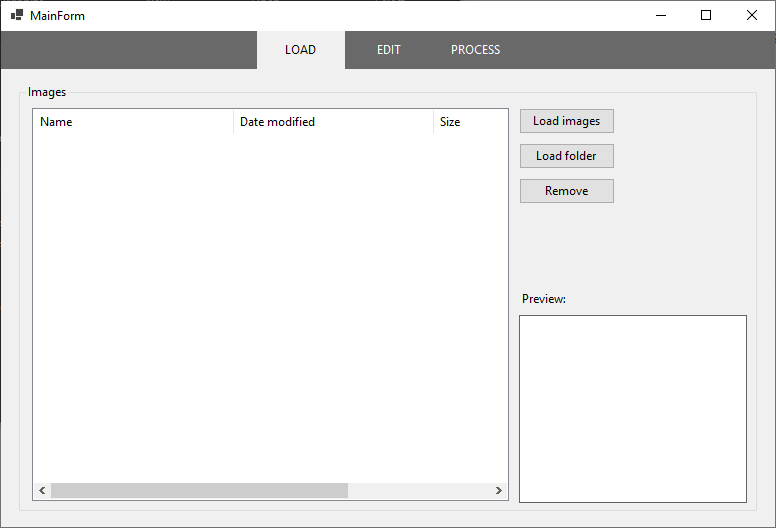
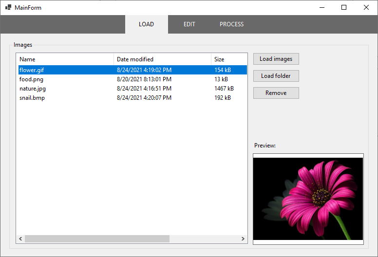
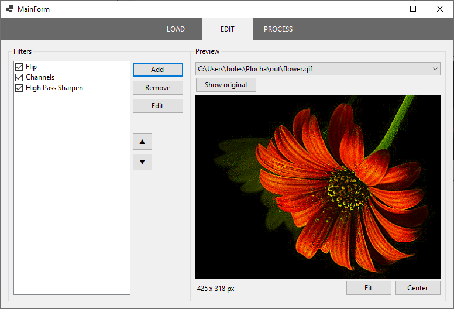
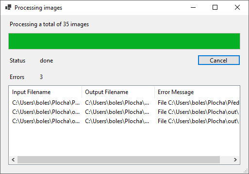

# BatchImageEditor

**BatchImageEditor** je jednoduchý editor pro větší množství obrázků najednou. Nahrajete své obrázky, zvolíte některé z nabídnutých úprav a necháte program obrázky zpracovat. Aby byl celý proces rychlejší, umožňuje aplikace spouštět výpočet paralelně.

Program je naprogramován v jazyce C# jako okenní aplikace WindowsForms.

## Obsah

- [Sestavení](#sestavení)
- [Návod k použití](#návod-k-použití)

## Sestavení

Sestavení programu můžete provést ve *Visual Studiu* nebo pomocí příkazové řádky:

````powershell
> dotnet build
````

Testy můžete spustit příkazem:

```powershell
> dotnet test
```

## Návod k použití

Program spustíte otevřením výsledného `*.exe` souboru po sestavení nebo pomocí příkazové řádky:

```powershell
> dotnet run
```

Otevře se okno editoru se scénou pro načítání obrázků.



Na vrchní části okna se nacházejí tlačítka pro změnu scény. Kliknutím na některé z nich můžete kdykoliv přepnout mezi scénou pro načítání obrázků (**LOAD**), jejich úpravu (**EDIT**) a konečné zpracování (**PROCESS**).

### Načtení obrázků

Načítání souborů probíhá ve scéně **LOAD**. 



Obrázky můžete načíst jednotlivě tlačítkem **Load images** nebo jako celou složku tlačítkem **Load folder**. Informace o souborech se pak objeví v seznamu nalevo. Pokud některý ze souborů v seznamu označíte, ukáže se náhled obrázku vpravo dole. Označené soubory můžete odebrat ze seznamu tlačítkem **Remove**.

Mezi **podporované formáty** patří JPEG, PNG, BMP a GIF.

### Úprava obrázků

K úpravě obrázků slouží scéna **EDIT**.



V levé části okna můžete upravovat seznam filtrů. Pro přidání filtru použijte tlačítko **Add** a v zobrazeném menu vyberte požadovaný filtr. Označené položky můžete odebrat pomocí tlačítka **Remove** nebo upravit kliknutím na **Edit**. Pokud filtr nechcete odstranit, ale pouze vynechat, využijte zaškrtávacího tlačítka vedle názvu položky. Jednotlivými filtry můžete v seznamu posouvat nahoru a dolů, čímž změníte pořadí jejich vykonávání. Filtry se na obrázek aplikují vždy v pořadí shora dolů.

V pravé části okna je náhled obrázku, který můžete zvolit na vysouvací liště v horní části. Mezi původním a zpracovaným obrázkem přepínáte tlačítkem **Show original** / **Show preview**. Pro zobrazení náhledu jsou dvě volby **Fit** (natáhnutí obrázku na velikost plochy) a **Center** (zobrazení obrázku doprostřed plochy v originální velikosti).

Při výběru nového filtru pomocí **Add** nebo úpravy existujícího pomocí **Edit** se zobrazí okno pro nastavení filtru. Například pro filtr **Flip** vypadá nastavení následovně:


V pravé části je náhled obrázku, v levé je nastavení filtru. Položky nastavení se pro každý filtr liší. Pro **Flip** je to typ převrácení, pro **Channels** je to změna jednotlivých barevných kanálů, atd.

Kliknutím na **Ok** se filtr s daným nastavením přidá do seznamu. Pomocí **Reset** se nastavení změní zpět na výchozí. Zavřením okna volbu zrušíte a změny nebudou uloženy.

### Zpracování

Ve scéně **Process** se nastavuje a provádí finální zpracování obrázků.


Zvolte cestu k výstupní složce pomocí tlačítka **Select**, nebo ji napište přímo do vstupního pole. Nastavit můžete i maximální počet vláken, který se použije na výpočet. Ve výchozím nastavení je zaškrtnuté **Use Core Count**, což znamená, že se použije stejný počet vláken, jako je počet jader procesoru na daném počítači. Odškrtnutím se povolí zápis do pole **Thread Count**, kde můžete nastavit počet vláken manuálně. Maximum je však dvojnásobek celkového počtu jader. Pokud zvolíte pouze 1 vlákno, výpočet bude probíhat sekvenčně a reakce editoru se velmi zpomalí.

Kliknutím na **Process** se zahájí výpočet a otevře se nové okno s informacemi o výpočtu:



Ve vrchní části okna můžete sledovat postup. Proces můžete kdykoliv přerušit tlačítkem **Cancel** nebo zavřením okna. Dole můžete vidět seznam chyb, které při výpočtu nastaly.

## Vývojová dokumentace

Dokumentace 

### Struktura programu

TODO

### Projekt ImageFilters

TODO

### Projekt 

## Možná vylepšení

TODO

