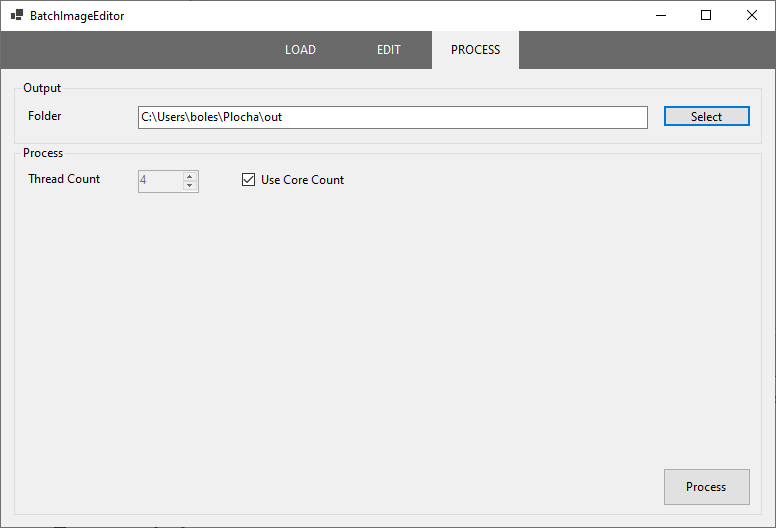

# BatchImageEditor

**BatchImageEditor** je jednoduchý editor pro větší množství obrázků najednou. Nahrajete své obrázky, zvolíte některé z nabídnutých úprav a necháte program obrázky zpracovat. Aby byl celý proces rychlejší, umožňuje aplikace spouštět výpočet paralelně.

Program je naprogramován v jazyce C# jako okenní aplikace WindowsForms.

## Obsah

- [Sestavení](#sestavení)
- [Návod k použití](#návod-k-použití)

## Sestavení

Sestavení programu můžete provést ve *Visual Studiu* nebo pomocí příkazové řádky:

````powershell
> dotnet build
````

Testy můžete spustit příkazem:

```powershell
> dotnet test
```

## Návod k použití

Program spustíte otevřením výsledného `*.exe` souboru po sestavení nebo pomocí příkazové řádky:

```powershell
> dotnet run
```

Otevře se okno editoru se scénou pro načítání obrázků.


Na vrchní části okna se nacházejí tlačítka pro změnu scény. Kliknutím na některé z nich můžete kdykoliv přepnout mezi scénou pro načítání obrázků (**LOAD**), jejich úpravu (**EDIT**) a konečné zpracování (**PROCESS**).

### Načtení obrázků

Načítání souborů probíhá ve scéně **LOAD**. 


Obrázky můžete načíst jednotlivě tlačítkem **Load images** nebo jako celou složku tlačítkem **Load folder**. Informace o souborech se pak objeví v seznamu nalevo. Pokud některý ze souborů v seznamu označíte, ukáže se náhled obrázku vpravo dole. Označené soubory můžete odebrat ze seznamu tlačítkem **Remove**.

Mezi **podporované formáty** patří JPEG, PNG, BMP a GIF.

### Úprava obrázků

K úpravě obrázků slouží scéna **EDIT**.


V levé části okna můžete upravovat seznam filtrů. Pro přidání filtru použijte tlačítko **Add** a v zobrazeném menu vyberte požadovaný filtr. Označené položky můžete odebrat pomocí tlačítka **Remove** nebo upravit kliknutím na **Edit**. Pokud filtr nechcete odstranit, ale pouze vynechat, využijte zaškrtávacího tlačítka vedle názvu položky. Jednotlivými filtry můžete v seznamu posouvat nahoru a dolů, čímž změníte pořadí jejich vykonávání. Filtry se na obrázek aplikují vždy v pořadí shora dolů.

V pravé části okna je náhled obrázku, který můžete zvolit na vysouvací liště v horní části. Mezi původním a zpracovaným obrázkem přepínáte tlačítkem **Show original** / **Show preview**. Pro zobrazení náhledu jsou dvě volby **Fit** (natáhnutí obrázku na velikost plochy) a **Center** (zobrazení obrázku doprostřed plochy v originální velikosti).

Při výběru nového filtru pomocí **Add** nebo úpravy existujícího pomocí **Edit** se zobrazí okno pro nastavení filtru. Například pro filtr **Flip** vypadá nastavení následovně:


V pravé části je náhled obrázku, v levé je nastavení filtru. Položky nastavení se pro každý filtr liší. Pro **Flip** je to typ převrácení, pro **Channels** je to změna jednotlivých barevných kanálů, atd.

Kliknutím na **Ok** se filtr s daným nastavením přidá do seznamu. Pomocí **Reset** se nastavení změní zpět na výchozí. Zavřením okna volbu zrušíte a změny nebudou uloženy.

### Zpracování

Ve scéně **Process** se nastavuje a provádí finální zpracování obrázků.



Zvolte cestu k výstupní složce pomocí tlačítka **Select**, nebo ji napište přímo do vstupního pole. Nastavit můžete i maximální počet vláken, který se použije na výpočet. Ve výchozím nastavení je zaškrtnuté **Use Core Count**, což znamená, že se použije stejný počet vláken, jako je počet jader procesoru na daném počítači. Odškrtnutím se povolí zápis do pole **Thread Count**, kde můžete nastavit počet vláken manuálně. Maximum je však dvojnásobek celkového počtu jader. Pokud zvolíte pouze 1 vlákno, výpočet bude probíhat sekvenčně a reakce editoru se velmi zpomalí.

Kliknutím na **Process** se zahájí výpočet a otevře se nové okno s informacemi o výpočtu:


Ve vrchní části okna můžete sledovat postup. Proces můžete kdykoliv přerušit tlačítkem **Cancel** nebo zavřením okna. Dole můžete vidět seznam chyb, které při výpočtu nastaly.

## Vývojová dokumentace

TODO úvod do programu - představení hlavních problémů a image processingu

součástí dokumentace je zdrojový kód a jeho komentáře

### Struktura programu

Program je dohromady složen z 5 projektů, z toho 1 jsou testy s použitím knihovny [xUnit](https://xunit.net/) a 1 je projekt benchmarků v [BenchmarkDotNet](https://benchmarkdotnet.org/).

Zbývající 3 projekty už přispívají ke kódu editoru:

- [ImageFilters](#projekt-imagefilters) - knihovna pro image processing.
- [BatchImageEditor](#projekt-batchimageeditor) - editor pro dávkovou úpravu obrázků využívající knihovnu ImageFilters.
- ThrowHelpers - knihovna obsahující pomocné třídy pro vyhazování výjimek. Není nijak zvlášť důležitá, proto dále není zmíněna.

### Projekt ImageFilters

Účelem knihovny ImageFilters je zpracování obrázků pomocí různých filtrů. Tyto operace mohou být velmi náročné a jedním z hlavních problémů bylo právě balancování rozšiřitelnosti a výkonu.

Tento projekt mimo jiné obsahuje třídy pro paralelní zpracování. Pro jediný obrázek to nejde jinak, než na něj aplikovat filtry sekvenčně. Pokud je ale obrázků více, může být posloupnost filtrů aplikována na každý ve stejnou chvíli.

#### Filtry

Pro kompatibilitu s *Windows Forms* byly použity třídy a struktury ze jmenného prostoru `System.Drawing`. V něm slouží pro reprezentaci obrázku třída `Bitmap`, ale přístup k jejím datům pomocí metod `GetPixel` a `SetPixel` je velmi pomalý. Pro náročné operace jsou k dispozici metody `LockBits` a `UnlockBits`, které nedovolí garbage collectoru přesouvat data obrázku a umožní tak přístup pomocí pointerů. Nakonec bylo použito řešení ze [stackoverflow](https://stackoverflow.com/a/34801225/13555057), které zavádí třídu `DirectBitmap` s přímým přístupem k datům v bufferu. Tento způsob je jednodušší a dokonce i rychlejší než zamykání, což bylo vyzkoušeno v projektu s benchmarky.

Důležitým rozhraním je `IImageFilter`, které předepisuje jedinou funkci `void Apply(ref DirectBitmap image)` V některých případech je nutné vytvořit obrázek nový a starý smazat, jindy stačí operaci vykonat přímo na vstupním obrázku. Aby bylo sémanticky jasné, že se při zavolání funkce obrázku vzdáváme, je předáván jako reference. Všechny filtry toto rozhraní implementují.

Některé filtry, např. `ResizingFilter`, používají návrhový vzor [Strategy](https://en.wikipedia.org/wiki/Strategy_pattern). Je definováno rozhraní reprezentující algoritmus, který se nějakým způsobem použije na filtrování obrázku. Pro změnu velikosti je to např. `IResizingAlgorithm`, který podle vstupního obrázku spočítá jeho výstupní velikost. Toto rozhraní implementují`FixedResizing` a `ResizingByFactor`, které počítají novou velikost jako fixní počet pixelů, respektive jako násobek staré velikosti.

Jiné filtry jsou rozšiřitelné pomocí dědičnosti. To platí například pro `LinearFilter`, jehož potomci mají společné to, že definují matici vah, která je jako okno "přiložena" na pixel a jeho výstupní hodnota bude spočítána jako součet pixelů vynásobených přiloženými vahami. Odvozené třídy tedy volají metodu `SetKernel`, čímž danou matici nastaví.

Filtry, u kterých se další rozšíření nepředpokládá (např. `FlipFilter`), ale u kterých je potřeba rozlišit způsob chování, mají na vstupu hodnotu typu `enum`. Pro převrácení obrázku je to například typ `FlipType` s hodnotami `Horizontal`, `Vertical` a `Both`.

U jiných filtrů je rozšiřitelnost Jiné filtry jsou implementovány pomocí dědičnosti

Knihovna ImageFilters mimo jiné obsahuje třídy pro paralelní zpracování. Pro jediný obrázek to nejde jinak, než na něj aplikovat filtry sekvenčně. Pokud je ale obrázků více, může na ně být posloupnost filtrů aplikována Na jeden obrázek musíme seznam filtrů aplikovat sekvenčně 

#### Paralelní zpracování


TODO

- úvod

- DirectBitmap - rychlé kreslení - problém se standardní Bitmap (proč se musí volat lock? co dělá? zamyká bitmapu pro garbage collection?) - zmínit odkaz ze stackoverflow, vysvětlit proč nebyl ideální Strategy pattern
- filtry, oop návrh
- paralelismus

#### Stará řešení a jiné poznámky

- 
- přehnané strategy - např. AdjustColors

### Projekt BatchImageEditor

TODO

- úvod

- zmínit absenci MVP, rozdělení do UserControl - např. scény a jiné prvky
- dock kvůli rozlišení
- návrh FilterSettings a modelů, problémy s designerem a generickými/abstraktními předky
- UIUpdater - stojí za zmínku kvůli paralelismu, "fronta tasků"

## Možná vylepšení

TODO

- hlavně MVP - testovatelnost
- Lepší návrh filtrů